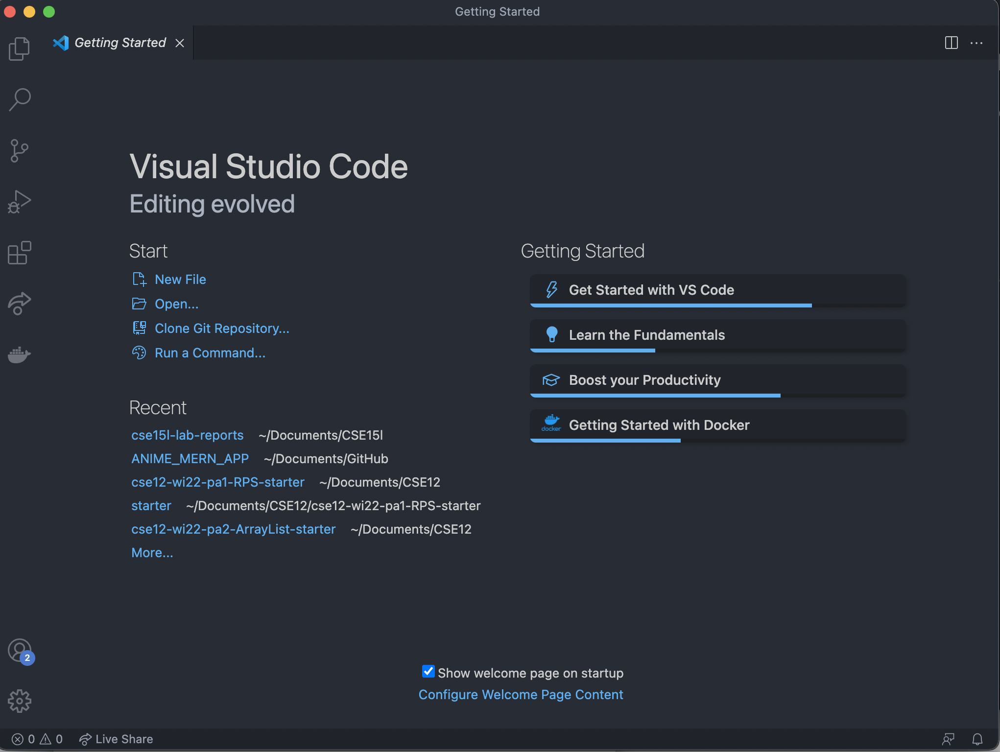
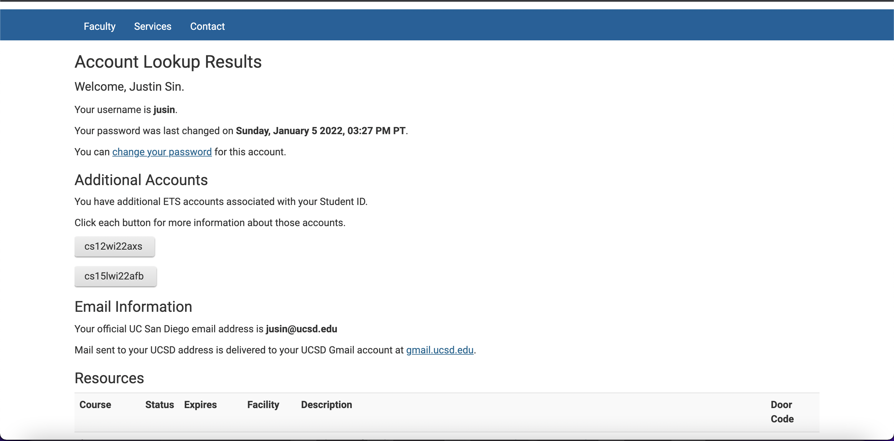
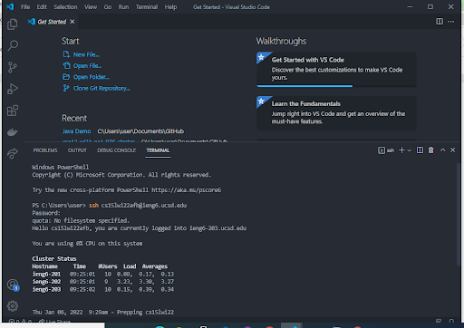
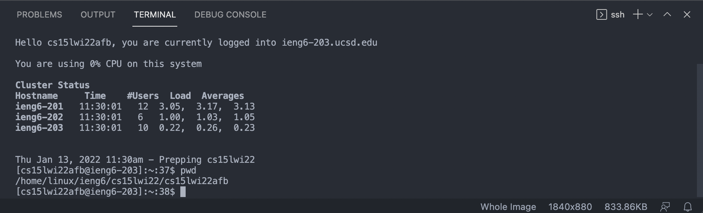
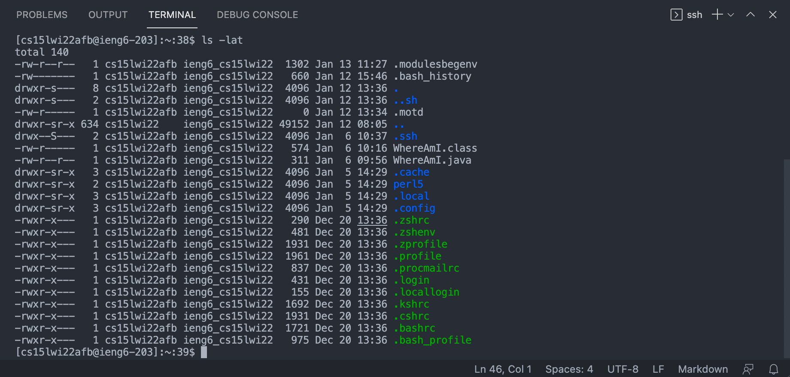
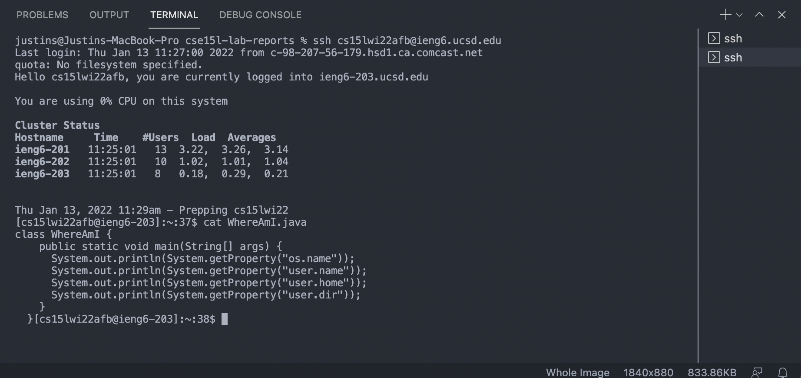
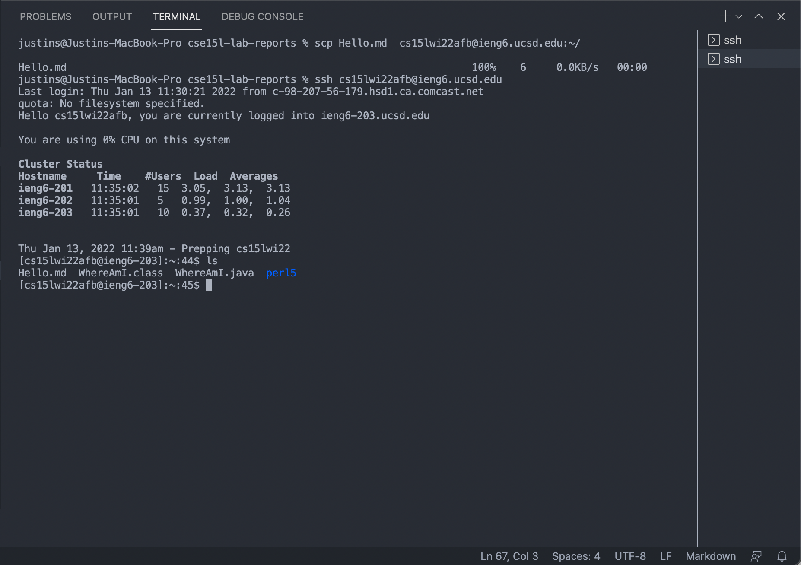
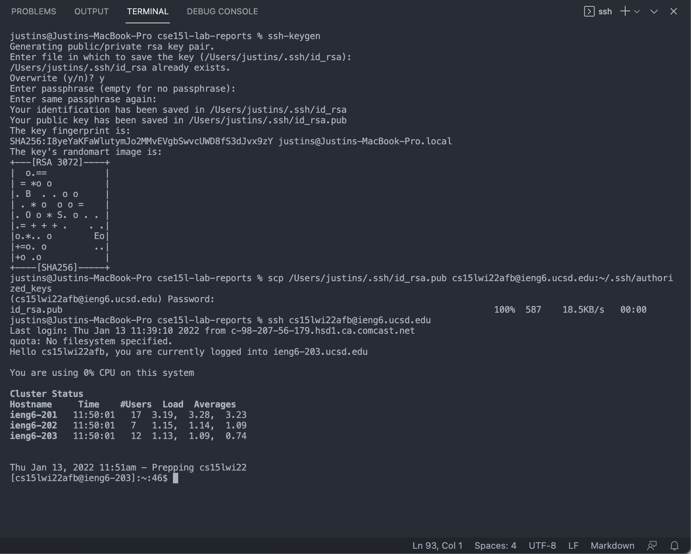
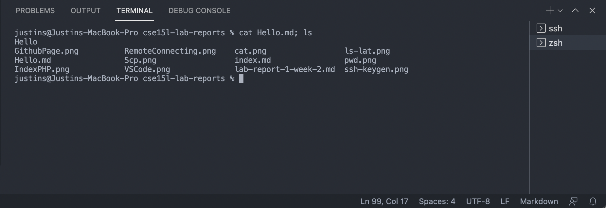
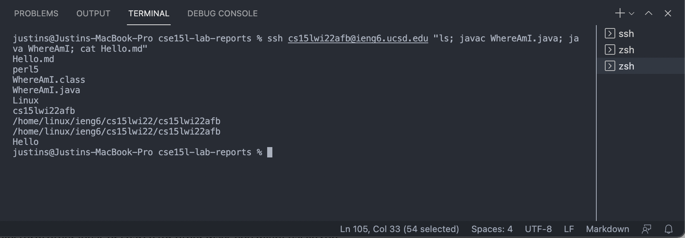

# *Lab 1 Week 2*

---

> # 1. **Installing Visual Studio Code**

* Go to the Visual Studio Code website 

[Visual Studio Code](https://code.visualstudio.com/)

* Click on the `Download` button for your operating system. OSX (for Macs) and Windows (for PCs)
* When done, open a new Visual Studio Code window and it should look something like this: 



---

> # 2. **Remotely Connecting**

* For windows, install [OpenSSH](https://docs.microsoft.com/en-us/windows-server/administration/openssh/openssh_install_firstuse)

* Look up your course-specific account for CSE15L:

[https://sdacs.ucsd.edu/~icc/index.php](https://sdacs.ucsd.edu/~icc/index.php)

* Login using your UCSD Student username and PID. You should see a page like this: 



* Open a terminal in VSCode (Ctrl or Command + `, or use the Terminal → New Terminal menu option) and enter this command where zzz is replaced by the letters in your cs15l account: 

```
$ ssh cs15lwi22zzz@ieng6.ucsd.edu
```

* Type yes and type your password when applicable. It should look like this when you are logged in:



---

> # 3. **Trying Some Commands**


```
$ cd ~
```

```
$ cd
```

```
$ ls
```

```
$ mkdir
```

```
$ ls
```

```
$ pwd
```



```
$ ls -lat
```



```
$ ls -a
```

```
$ ls <directory>

where <directory> is /home/linux/ieng6/cs15lwi22/cs15lwi22zzz
```


```
$ cp /home/linux/ieng6/cs15lwi22/public/hello.txt ~/
```

```
$ cat /home/linux/ieng6/cs15lwi22/public/hello.txt
```



---

> # 4. **Moving Files with `scp`**

* `scp` means secure copy and allows us to securely transfer files between computers (client to server)

* Create a file `Hello.md` and put some text into it. For ex. "Hello"

* Then from your computer run:

```
scp Hello.md cs15lwi22zzz@ieng6.ucsd.edu:~/
```

* Then login with:

```
$ ssh cs15lwi22zzz@ieng6.ucsd.edu
```

and run the `ls` command to determine if the transfer was successful. It should look like this: 



---

># 5. **Setting an SSH Key**

* First, run the command `$ ssh-keygen` on the terminal. Press `enter` for the prompts.

* on Windows, follow the ssh-add steps also: 

[https://docs.microsoft.com/en-us/windows-server/administration/openssh/openssh_keymanagement#user-key-generation](https://docs.microsoft.com/en-us/windows-server/administration/openssh/openssh_keymanagement#user-key-generation)


* Next run:

```
$ ssh cs15lwi22zz@ieng6.ucsd.edu
```

```
$ mkdir .ssh
```

```
$ exit
```

```
$ scp <your-id_rsa.pub-path>/.ssh/id_rsa.pub cs15lwi22zzz@ieng6.ucsd.edu:~/.ssh/authorized_keys
```

* Finally, you should be able to login to the server without entering your password. The process should look like this: 



---

# 6. **Optimizing Remote Running**

* You can run multiple commands on one line in the terminal by using `;`:

```
cat Hello.md; ls
```



* You can also run multiple commands on the remote server and exit after by using `ssh`, `""`, and `;`:

```
ssh cs15lwi22zzz@ieng6.ucsd.edu "ls; javac WhereAmI.java; java WhereAmI; cat Hello.md"
```




[Return to Home Page](https://jusinucsd26.github.io/cse15l-lab-reports/)