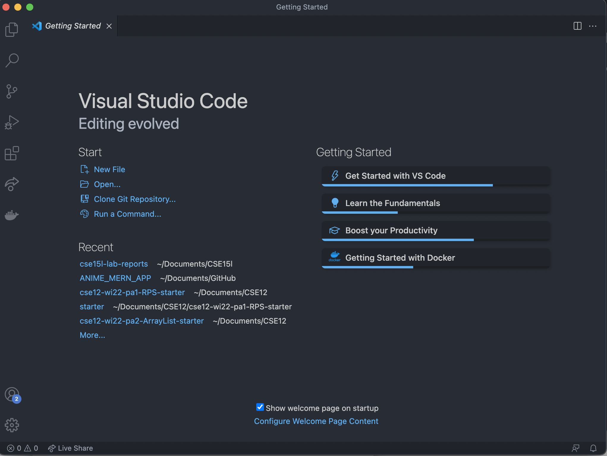
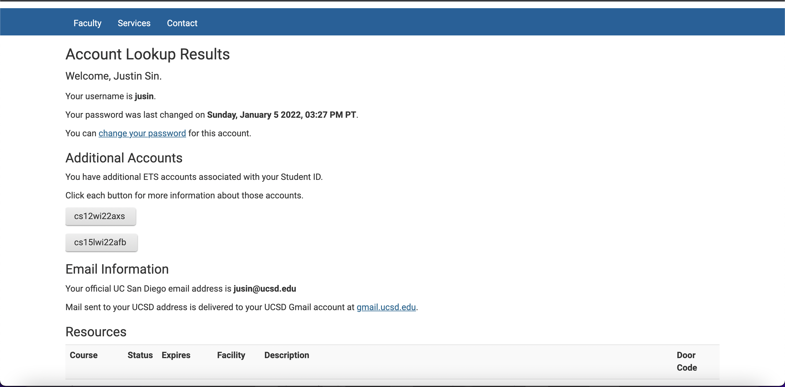
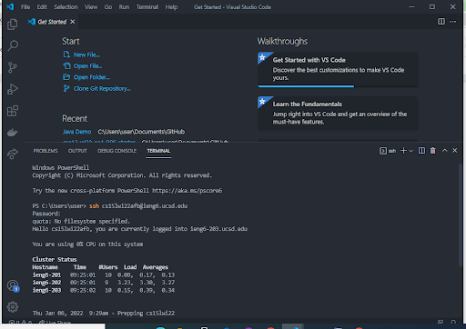
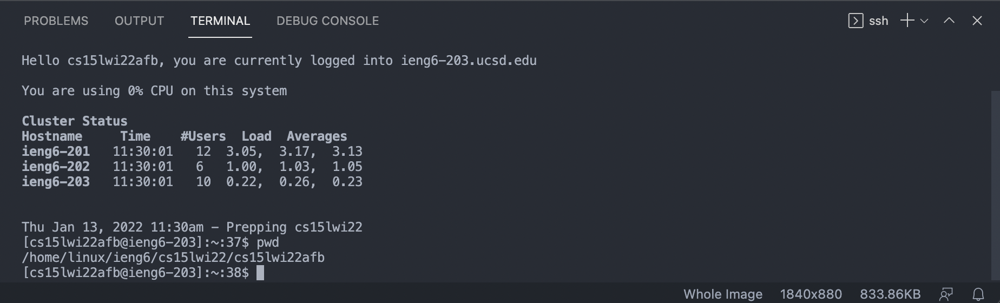
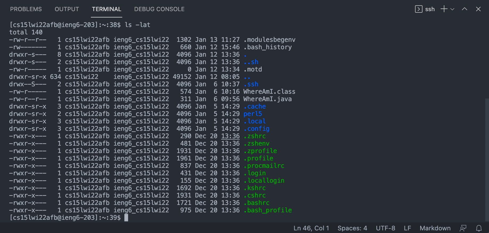
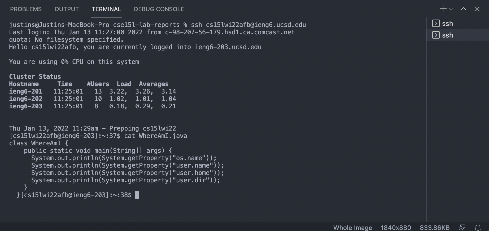
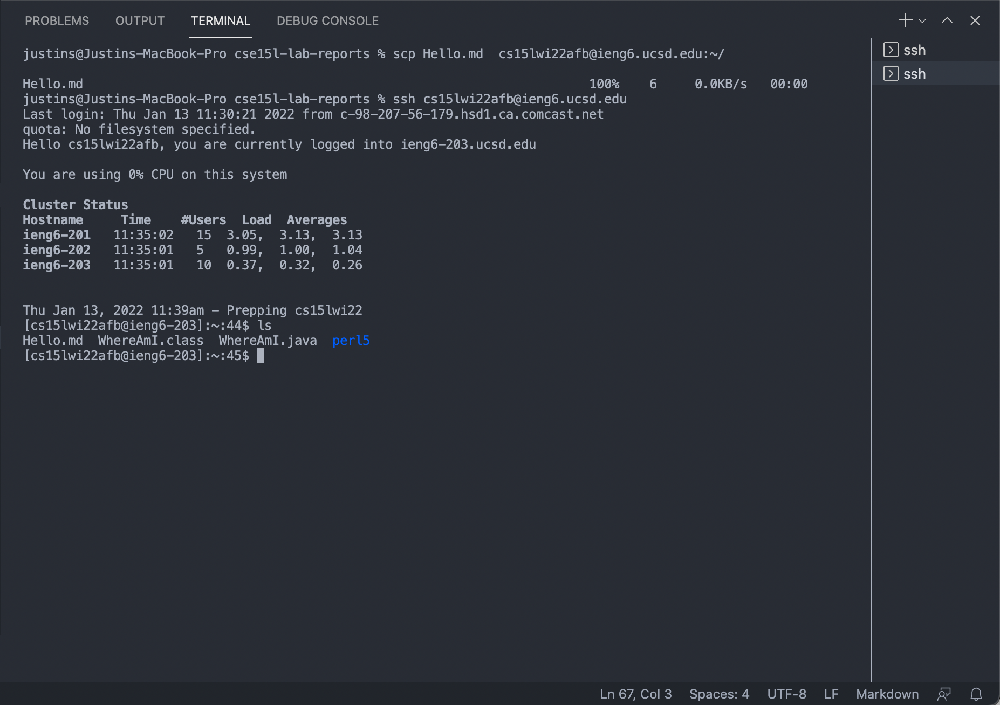
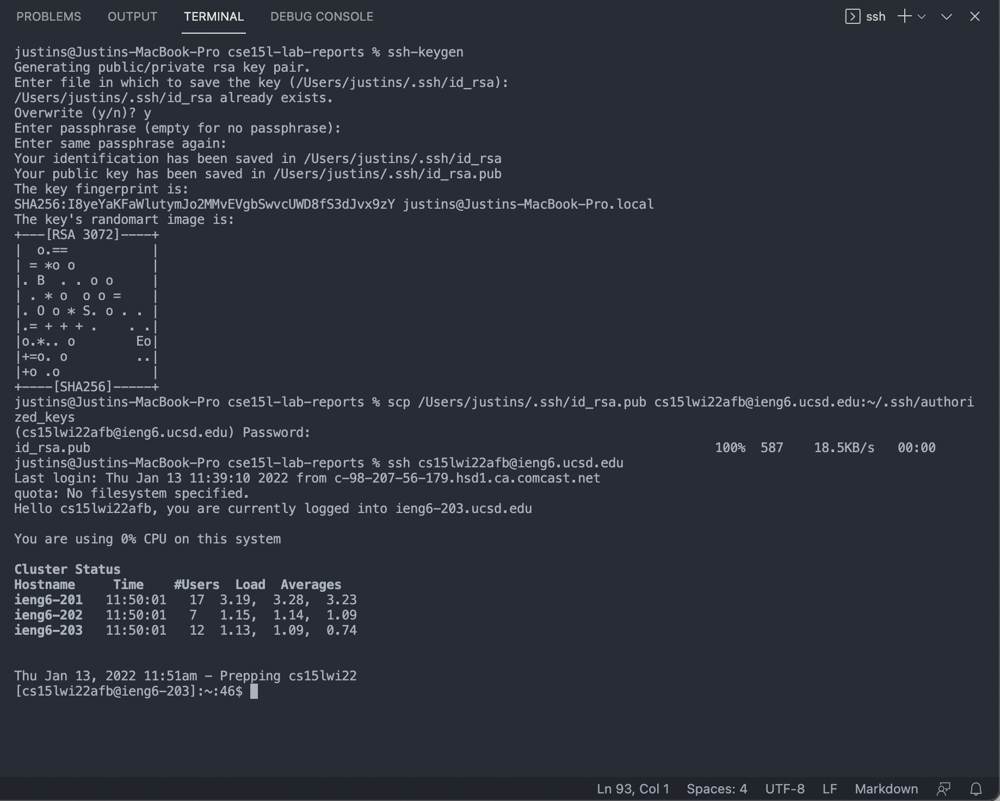
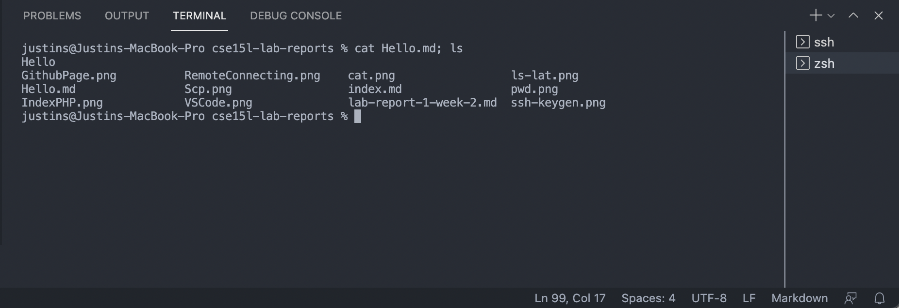
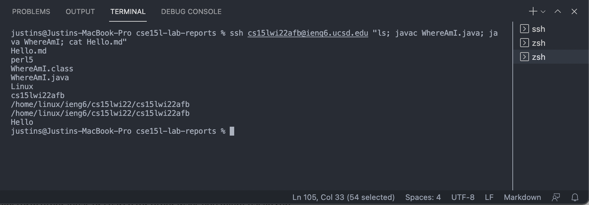

# _Lab 1 Week 2_

---

> # 1. **Installing Visual Studio Code**

- Go to the Visual Studio Code website

[Visual Studio Code](https://code.visualstudio.com/)

- Click on the `Download` button for macOS

- When done, open a new Visual Studio Code window and it should look something like this:



---

> # 2. **Remotely Connecting**

- Look up your course-specific account for CSE15L:

[https://sdacs.ucsd.edu/~icc/index.php](https://sdacs.ucsd.edu/~icc/index.php)

- Login using your UCSD Student username and PID. You should see a page like this:



- Open a terminal in VSCode (Ctrl or Command + `, or use the Terminal → New Terminal menu option). Then run:

```
$ ssh cs15lwi22afb@ieng6.ucsd.edu
```

- Type yes and type your password when applicable. It should look like this when you are logged in:



---

> # 3. **Trying Some Commands**

```
$ cd ~
```

```
$ cd
```

```
$ mkdir
```

```
$ ls
```

```
$ pwd
```



```
$ ls -lat
```



```
$ ls -a
```

```
$ ls <directory>

where <directory> is /home/linux/ieng6/cs15lwi22/cs15lwi22afb
```

```
$ cp /home/linux/ieng6/cs15lwi22afb/public/hello.txt ~/
```

```
$ cat /home/linux/ieng6/cs15lwi22afb/public/hello.txt
```



---

> # 4. **Moving Files with `scp`**

- `scp` means secure copy and allows us to securely transfer files between computers (client to server)

- Create a file `Hello.md` and put some text into it. For ex. "Hello"

- Then from your computer run:

```
$ scp Hello.md cs15lwi22afb@ieng6.ucsd.edu:~/
```

- Then ssh into the remote server with:

```
$ ssh cs15lwi22afb@ieng6.ucsd.edu
```

and run the `ls` command to determine if the transfer was successful. It should look like this:



---

> # 5. **Setting an SSH Key**

- First, run the command `ssh-keygen` on the terminal. Press `enter` for the prompts.

- Next run:

```
$ ssh cs15lwi22afb@ieng6.ucsd.edu
```

```
$ mkdir .ssh
```

```
$ exit
```

```
$ scp <your-id_rsa.pub-path>/.ssh/id_rsa.pub cs15lwi22afb@ieng6.ucsd.edu:~/.ssh/authorized_keys

In this case <your-id_rsa.pub-path> is /Users/justins
```

- Finally, you should be able to login to the server without entering your password. The process should look like this:



---

> # 6. **Optimizing Remote Running**

- You can run multiple commands on one line in the terminal by using `;`:

```
$ cat Hello.md; ls
```



- You can also run multiple commands on the remote server and exit after by using `ssh`, `""`, and `;`:

```
$ ssh cs15lwi22afb@ieng6.ucsd.edu "ls; javac WhereAmI.java; java WhereAmI; cat Hello.md"
```



- The one line of commands above takes 87 keystrokes to execute. Using the up-arrow key to rerun the command would take 2 keystrokes.
  <br />

- Running each separately like:

```
$ ssh cs15lwi22afb@ieng6.ucsd.edu
```

```
$ ls
```

```
$ javac WhereAmI.java
```

```
$ java WhereAmI
```

```
$ cat Hello.md
```

```
$ exit
```

also takes 87 keystrokes.

However, using the up-arrow command to rerun all of the individual commands above would take a total of 42 keystrokes which is twenty one times more keystrokes than the multiple commands on one line.

Thus, running multiple commands on one line can be much more efficient for remote running.

[Return to Home Page](https://jusinucsd26.github.io/cse15l-lab-reports/)
