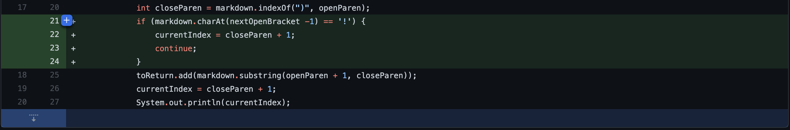
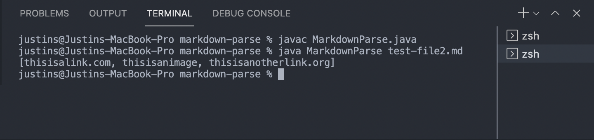
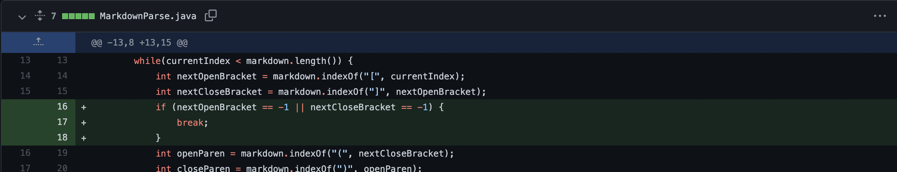
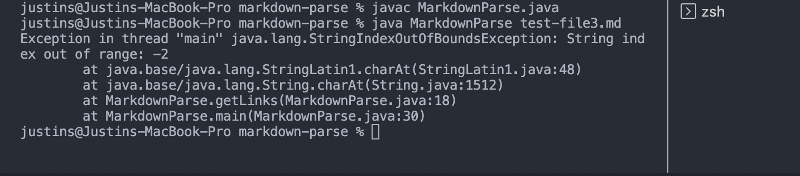
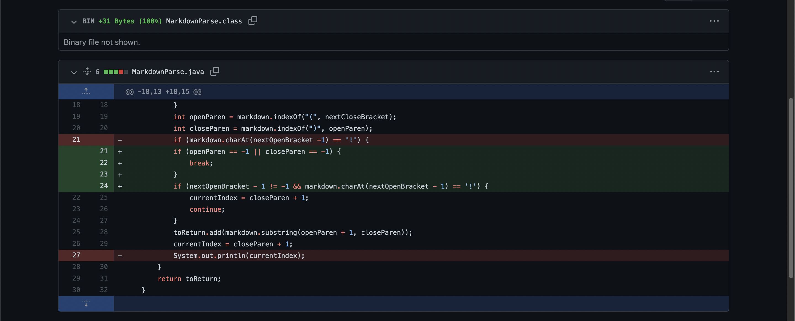
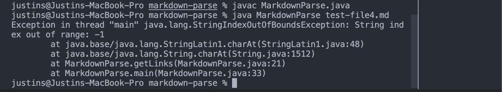

# _Lab 2 Week 4_

---

> # _<u>Code Change #1</u>_



## <u>Test File Link</u>

[https://github.com/jusinucsd26/markdown-parse/blob/main/test-file2.md?plain=1](https://github.com/jusinucsd26/markdown-parse/blob/main/test-file2.md?plain=1)

## <u>Symptom</u>



Instead of printing

```
[thisisalink.com, thisisanimage, thisisanotherlink.org]
```

it should have only printed

```
[thisisalink.com, thisisanotherlink.org]
```

since MarkdownParse should only return the URL Links and not images.

## <u>Relationship</u>

The _failure-inducing input_ was

```
# Title

[link 1](thisisalink.com)

[link 2](thisisanotherlink.org)
```

This caused a symptom where the program printed an incorrect answer. The list returned by the program should not also have contained the image path in the file. This symptom occurred because the code would find all the text in between parantheses that came after brackets which implied that there was a bug. To fix this bug, we had to check if the open bracket had an exclamation mark behind it using the code `markdown.charAt(nextOpenBracket - 1) == '!'`. If true, that means it's an image path and the code should not add that to the returned list.

---

> # _<u>Code Change #2</u>_



## <u>Test File Link</u>

[https://github.com/jusinucsd26/markdown-parse/blob/main/test-file3.md?plain=1](https://github.com/jusinucsd26/markdown-parse/blob/main/test-file3.md?plain=1)

## <u>Symptom</u>



An `IndexOutOfBoundsException` occurred in which the String index was out of range at -2

## <u>Relationship</u>

The _failure-inducing input_ was

```
# Title

[link 1](link[1].com)
[link 2](link[].org)
```

This caused a symptom where an `IndexOutOfBoundsException` occurred because in the while-loop, a next open bracket was not found and so the variable `nextOpenBracket` was equal to -1. Thus, when `markdown.charAt(nextOpenBracket - 1) == '!'`, this would produce the `String index out of range: -2` error. To fix this bug in the code, we added if-statements to check if `nextOpenBracket` or `nextCloseBracket` equals -1 and if true, we break the loop since that means there's no more links to be found.

---

> # _<u>Code Change #3</u>_



## <u>Test File Link</u>

[https://github.com/jusinucsd26/markdown-parse/blob/main/test-file4.md?plain=1](https://github.com/jusinucsd26/markdown-parse/blob/main/test-file2.md?plain=1)

## <u>Symptom</u>



An `IndexOutOfBoundsException` occurred in which the String index was out of range at -1

## <u>Relationship</u>

The _failure-inducing input_ was

```
# Title

[link 1](thisisalink.com)

[link 2](thisisanotherlink.org)
```

This caused a symptom where an `IndexOutOfBoundsException` error was thrown because for the first open bracket in the markdown string, accessing
`markdown.charAt(nextOpenBracket - 1)` would be -1 which is out of bounds since the first character of a String begins at index 0. This bug in the code was solved by first checking if
`nextOpenBracket - 1` is not equal to -1.

[Return to Home Page](https://jusinucsd26.github.io/cse15l-lab-reports/)
