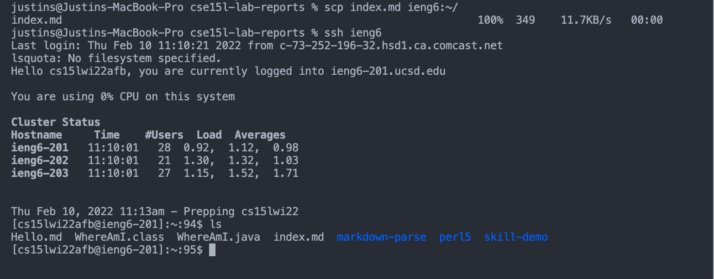

# _Lab 2 Week 4_

---

## Streamlining ssh Configuration


- Open a new terminal

- Create a `config` file in the `.ssh` directory using the `touch` command


- Use the command `vim config` to modify the config text file

- Press `I` on keyboard to insert `Host ieng6 HostName ieng6.ucsd.edu User cs15lwi22zzz`

- Press `escape` key then `:wq` to exit out of vim

- Alternatively, you can do `open config` in the terminal and type the text


- Type ssh ieng6 on the terminal and you should be able to login to the UCSD computer



- Go into a directory with some file and secure copy the file to ieng6 with the command:

```
scp index.md ieng6:~/
```

[Return to Home Page](https://jusinucsd26.github.io/cse15l-lab-reports/)
