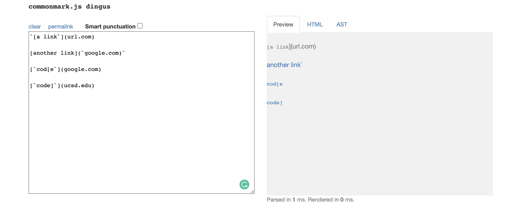
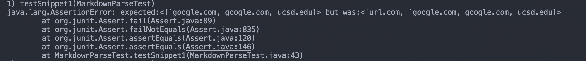
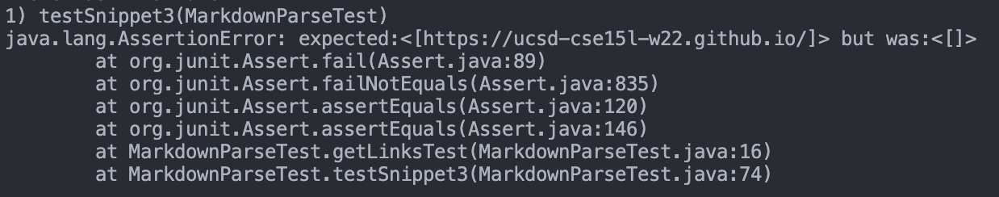
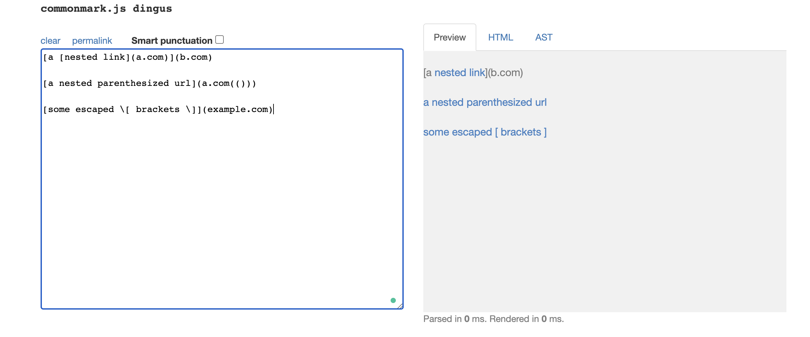
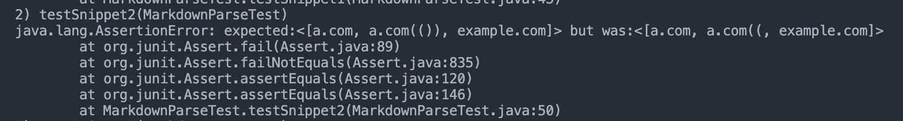
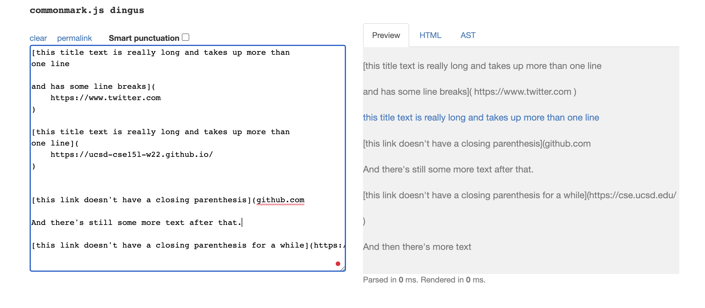
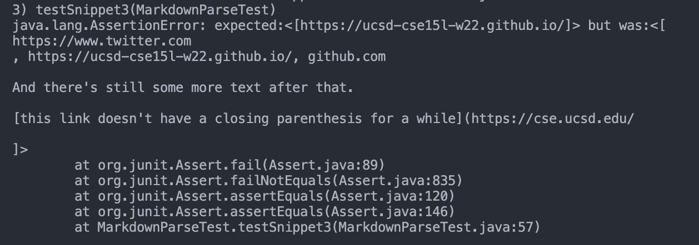

# _Lab 4 Week 8_

---

## Markdown Parse Repositories

My Repository: [https://github.com/jusinucsd26/markdown-parse](https://github.com/jusinucsd26/markdown-parse)

Repository I Reviewed: [https://github.com/atruong39/markdown-parse](https://github.com/atruong39/markdown-parse)

## **Snippet 1**

Preview:



<br>

### My Implementation

- Test Method:

```
@Test
public void testSnippet1() throws IOException {
    List<String> expected = List.of("`google.com", "google.com", "ucsd.edu");
    String contents = Files.readString(Path.of("./snippet-1.md"));
    assertEquals(expected, MarkdownParse.getLinks(contents));
}
```

<br>

- This test did not pass. Output:



- I think it is a small code change that can make my program work for cases that use inline code with backticks. This be solved by adding a if-statement to check if there are any backticks before the open parantheses similar to checking for exclamation marks. Then if there are backticks before the open parantheses then it won't be considered a link.

- The solution code would look something like:

```
if (nextOpenBracket - 1 != -1 && markdown.charAt(nextOpenBracket - 1) == '`') {
    currentIndex = closeParen + 1;
    continue;
}
```

<br>

### Implementation I Reviewed

- Test Method:

```
@Test
public void testSnippet1() {
    List<String> expected = List.of("`google.com", "google.com", "ucsd.edu");
    getLinksTest("snippet-1.md", expected);
}
```

<br>

- This test method did not pass. Output:
  

## **Snippet 2**

Preview:



<br>

### My Implementation

- Test Method:

```
@Test
public void testSnippet2() throws IOException {
    List<String> expected = List.of("a.com", "a.com(())", "example.com");
    String contents = Files.readString(Path.of("./snippet-2.md"));
    assertEquals(expected, MarkdownParse.getLinks(contents));
}
```

<br>

- This test did not pass. Output:



- I think this will require a slightly larger code change (>10 lines) to fix for all cases involving nested brackets, parantheses, and escaped brackets. I would need to add a helper function that finds the closing bracket, paranthesis, or escaped bracket for its respective opening. This would involve using a while loop and incrementing the closing index until it's found and then returning that.

- The solution helper method would essentially be like this:

```
static int findCloseParen(String markdown, int openParen) {
    int closeParen = openParen + 1;
    int openParenCount = 1;
    while (openParenCount > 0) {
        if (markdown.charAt(closeParen) == '(') {
            openParenCount++;
        } else if (markdown.charAt(closeParen) == ')') {
            openParenCount--;
        }
        closeParen++;
    }
    return closeParen - 1;

}
```

<br>

### Implementation I Reviewed

- Test Method:

```
@Test
public void testSnippet2() {
    List<String> expected = List.of("a.com", "a.com(())", "example.com");
    getLinksTest("snippet-2.md", expected);
}
```

<br>
* This test method passed for the implementation I reviewed.

## **Snippet 3**

Preview:



<br>

### My Implementation

- Test Method:

```
@Test
public void testSnippet3() throws IOException{
    List<String> expected = List.of("https://ucsd-cse15l-w22.github.io/");
    String contents = Files.readString(Path.of("./snippet-3.md"));
    assertEquals(expected, MarkdownParse.getLinks(contents));
}
```

<br>

- This test did not pass. Output:



- I think this will require a small code change to make my program work for cases that have newlines in brackets and parantheses. It seems that if there are more than 1 newlines in brackets or parantheses then the markdown won't view it as a link. To fix this, I could add an if-statement to the code and use `indexOf("\n\n")` to check if two newlines occur successively and if so, then I can not consider it as a link.

- The solution code will look something like:

```
var potentialLink = markdown.substring(openParen + 1, closeParen);
if (!potentialLink.contains("\n\n")) {
    toReturn.add(markdown.substring(openParen + 1, closeParen));
}
```

<br>

### Implementation I Reviewed

- Test Method:

```
@Test
public void testSnippet3() {
    List<String> expected = List.of("https://ucsd-cse15l-w22.github.io/");
    getLinksTest("snippet-3.md", expected);
}
```

<br>
* This test method passed for the implementation I reviewed.

<br>

[Return to Home Page](https://jusinucsd26.github.io/cse15l-lab-reports/)
