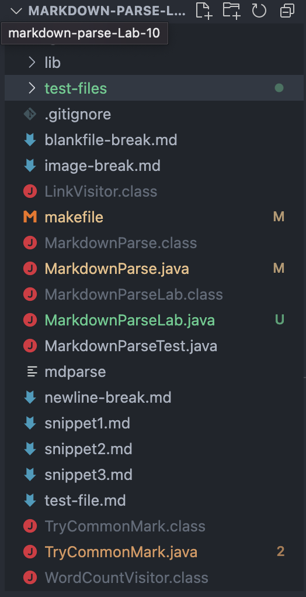
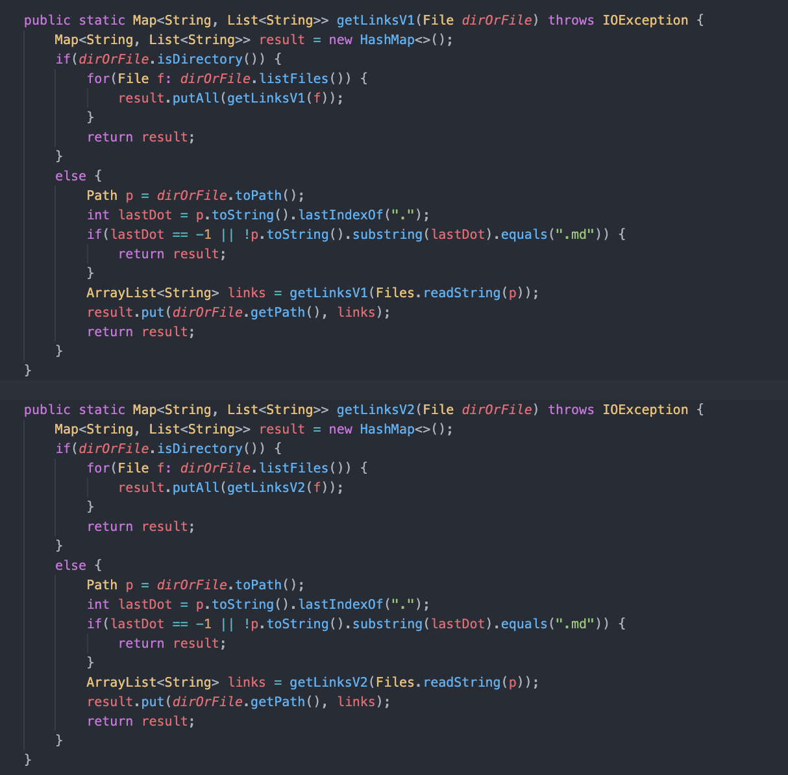
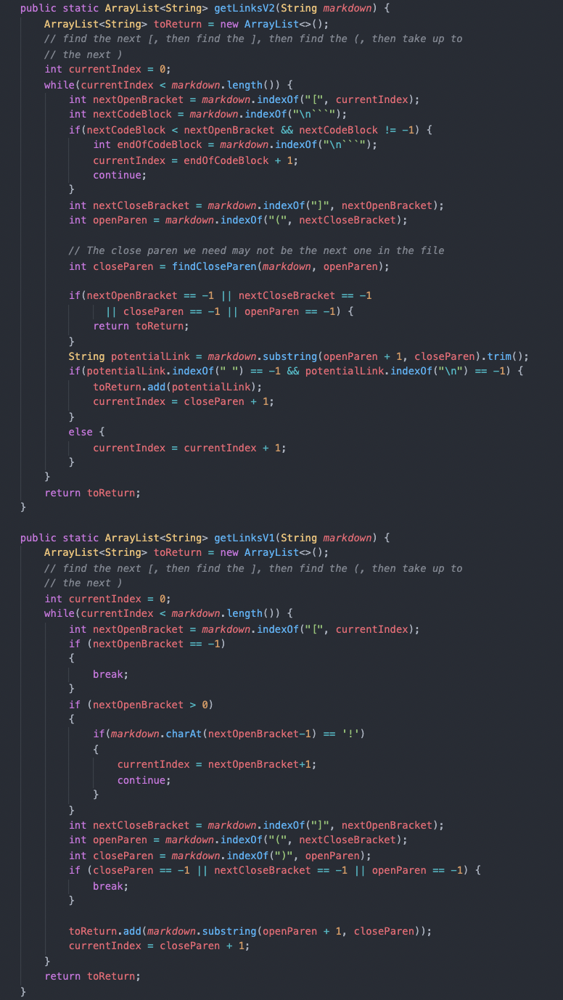
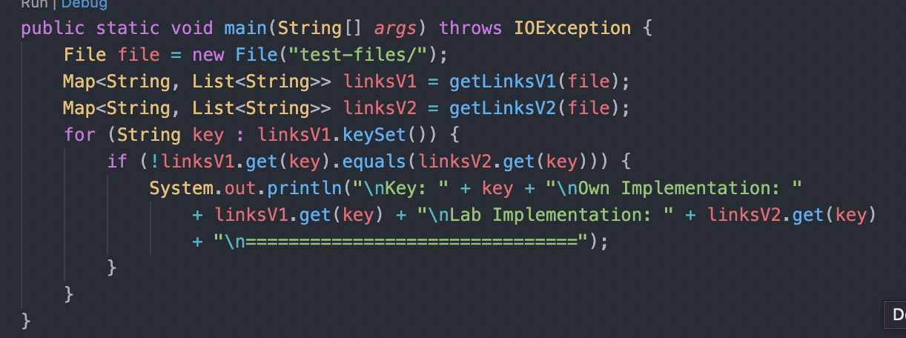
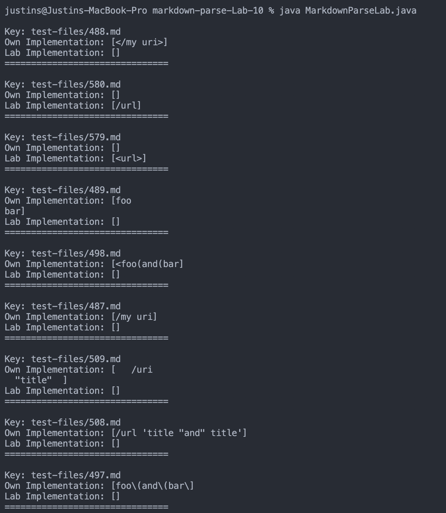
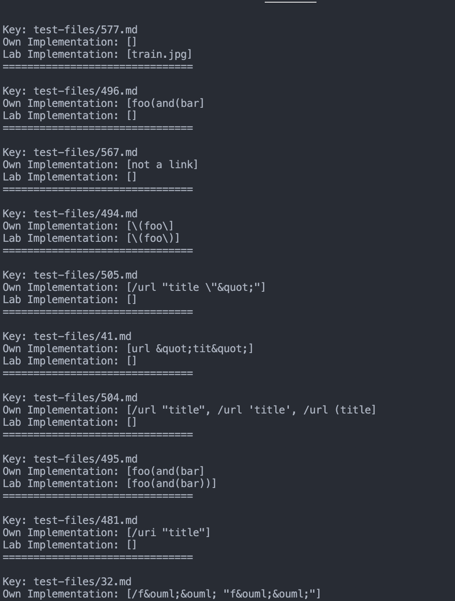
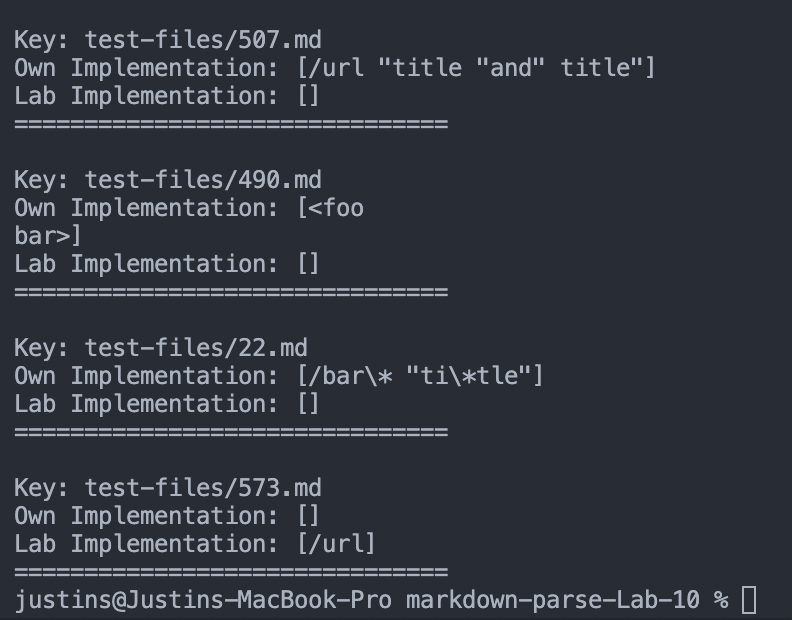
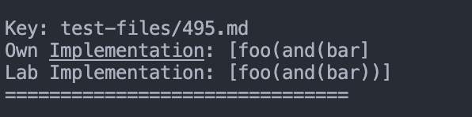
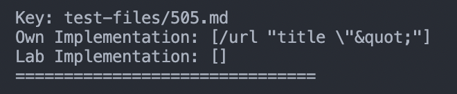
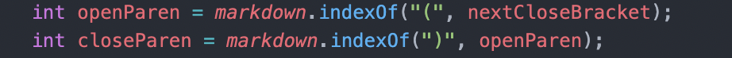

# _Lab 5 Week 10_

---

## Markdown Parse Repositories

My Group Repository: [https://github.com/zfxd/markdown-parse](https://github.com/zfxd/markdown-parse)

Lab Repository: [https://github.com/ucsd-cse15l-w22/markdown-parse](https://github.com/ucsd-cse15l-w22/markdown-parse)

## **<u>Finding Tests with Different Results</u>**

- First, I made a copy of the test files folder from the Lab Repo into my repository root directory.



- Next, I copied over the getLinks methods from the Lab implementation into my MarkdownParseLab.java file and renamed the methods so they don't conflict with our implementation of the getLinks methods.





- Next, I updated the code in the main method of MarkdownParseLcab.java to run the getLinks methods for the test-files folder and then printed out the test results that were not equal (different results).



- Finally, I ran

```
Javac MarkdownParseLcab.java
```

followed by

```
Java MarkdownParseLab
```

and here are the results:





## **<u>Comparing Tests</u>**

> ### Test 495

- Expected Output:

```
[foo(and(bar))]
```

- Actual Output:



- This means that the Lab implementation is correct and my implementation was incorrect.

- The problem with my implementation is that it does not check for the matching closing paranthesis but rather just the nearest closing paranthesis. This means that links with multiple parantheses will cause the getLinks method to return a shorter string rather than the entire length of the link.

- To solve this bug, we would need to implement a method to find the matching closing paranthesis like:

```
static int findCloseParen(String markdown, int openParen) {
    int closeParen = openParen + 1;
    int openParenCount = 1;
    while (openParenCount > 0 && closeParen < markdown.length()) {
        if (markdown.charAt(closeParen) == '(') {
            openParenCount++;
        } else if (markdown.charAt(closeParen) == ')') {
            openParenCount--;
        }
        closeParen++;
    }
    if(openParenCount == 0) {
        return closeParen - 1;
    }
    else {
        return -1;
    }
}
```

> ### Test 505

- Expected Result:

```
[/url]
```

- Actual Result:



- Based on the expected and actual results, both implementations are incorrect

- The issue with my implementation is that the getLinks method considers everything in the parantheses to be part of the link and so even the text with the quotation marks are included. Markdown considers the text in the quotation to be part of the `title` prop of the link rather than the actual link itself.

- To solve this, I would need to check for quotations within the open and closing parathesis. If there are quotation marks between the paranthesis, then I would just add the string from the opening paranthesis to the first quote to the arraylist.

- The code that needs to be fixed is:



- Before finding the closeParen, I would look for quotation marks starting from openParen and add an `if statement` to exclude the text with quotation marks from the link if the quotations exists.

<br>

[Return to Home Page](https://jusinucsd26.github.io/cse15l-lab-reports/)
